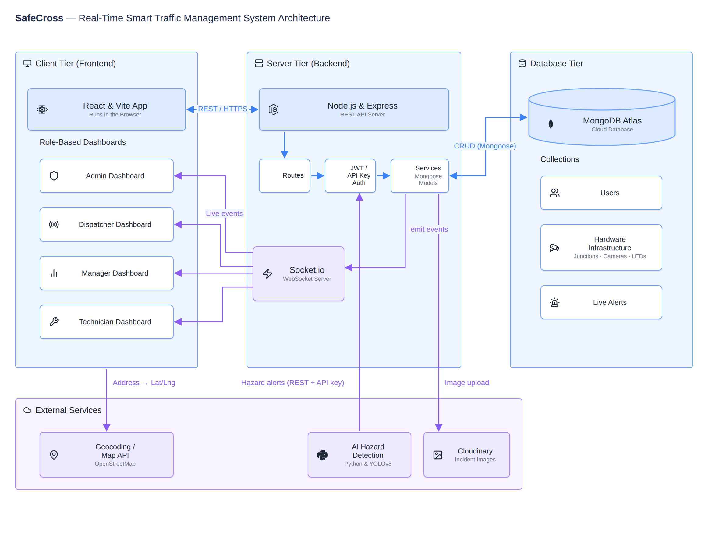
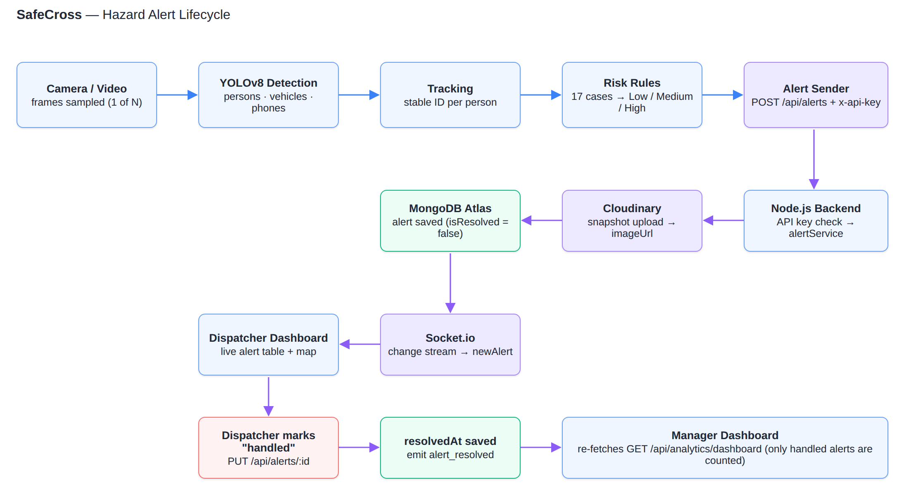

# SafeCross – AI-Based Smart Crosswalk System

SafeCross turns a regular camera at a pedestrian crossing into an active safety sensor. A computer-vision service detects pedestrians, tracks them, and classifies dangerous behaviour in real time. Alerts are pushed instantly to a control center, where operators handle them, and managers get reliable safety statistics.

Final project, Faculty of Science, HIT – Holon Institute of Technology.



## Features

- **Real-time hazard detection** – YOLOv8 detects pedestrians, vehicles and phones in video; each person is tracked across frames.
- **Behavioural risk classification** – 17 predefined risk cases (Low / Medium / High), so only dangerous or unpredictable behaviour becomes an alert.
- **Live control center** – alerts appear on the dispatcher's table and map within about a second (Socket.io, no page refresh).
- **Four role-based dashboards** – Admin, Manager, Dispatcher and Technician, each with its own permissions.
- **Server-side analytics** – KPIs, most dangerous junctions, school zones, weekly trend and severity split, computed in MongoDB.
- **Infrastructure management** – junctions, cameras and LED warning strips, synchronized live between all connected users.

## Tech stack

| Layer | Technologies |
|---|---|
| Frontend | React, Vite, Tailwind CSS, React Router, Socket.io client, Recharts, React-Leaflet |
| Backend | Node.js, Express, Socket.io, Mongoose, JWT, bcrypt |
| Database & storage | MongoDB Atlas, Cloudinary |
| AI service | Python, Ultralytics YOLOv8, OpenCV, FastAPI |

## Repository structure

```
AI_Smart_Crosswalk/
├── backend/            Node.js REST API + Socket.io server
│   ├── config/         Database, Socket.io and Cloudinary setup
│   ├── middleware/     JWT authentication, role authorization, sensor API key
│   ├── models/         Mongoose schemas
│   ├── routes/         REST endpoints
│   ├── services/       Business logic
│   ├── tests/          Seed script and end-to-end tests
│   └── ai-service/     Python video analysis (YOLOv8, tracking, risk rules)
├── frontend/           React single-page application
└── docs/               Diagrams and project documents
```

Each folder has its own README with more detail.

## Getting started

### Prerequisites

- Node.js 20 or newer
- Python 3.10 or newer (only for the AI service)
- A MongoDB Atlas cluster and a Cloudinary account

### 1. Backend

```bash
cd backend
npm install
cp .env.example .env      # then fill in the real values
npm run seed              # one time: demo users, junctions, cameras, LEDs, alerts
npm start                 # http://localhost:3000
```

### 2. Frontend

```bash
cd frontend
npm install
# create frontend/.env with:  VITE_API_URL=http://localhost:3000/api
npm run dev               # http://localhost:5173
```

### 3. AI service (optional)

```bash
cd backend/ai-service
python -m venv venv
venv\Scripts\activate     # macOS / Linux: source venv/bin/activate
pip install -r requirements.txt
python main.py --source path/to/video.mp4
```

See [backend/ai-service/README.md](backend/ai-service/README.md) for all options.

## How an alert flows through the system



1. The AI service analyses video frames, tracks each person and classifies the behaviour.
2. A risky case is sent to `POST /api/alerts`, authenticated with an API key.
3. The backend stores the alert in MongoDB and the snapshot in Cloudinary.
4. A MongoDB change stream pushes the alert to all dispatchers through Socket.io.
5. A dispatcher marks the alert as handled; the manager dashboard refreshes its statistics.

## User roles

| Role | Main capabilities |
|---|---|
| Admin | Manage users; manage junctions, cameras and LED strips |
| Manager | View safety statistics and export a PDF report |
| Dispatcher | Monitor the live map and alert table; mark alerts as handled |
| Technician | See faulty equipment and mark it as fixed |

## Testing

```bash
cd backend
npm run test:e2e                                          # backend end-to-end suite (in-memory MongoDB)

cd ai-service
python -m unittest discover -s tests -t . -v              # AI risk rules, tracker, video processor
```

## Security notes

- Never commit `.env` files. Secrets belong in environment variables only.
- User requests are authenticated with a JWT; the AI service uses a separate API key (`x-api-key`).
- The demo users created by the seed script are for development only.

## Team

Netanel Kadoshi · Or Smolarchik · Rachel Brodsky · Yosef Yosef · Liel Babayn

Mentor: Netanel Ben Hamo
