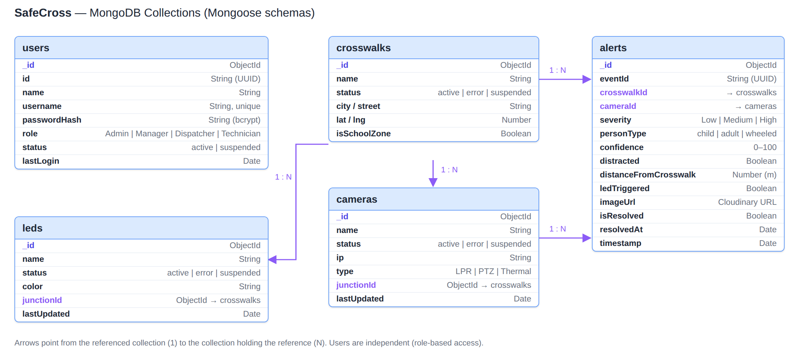

# models

Mongoose schemas. Each file defines one MongoDB collection, with its field types, required fields and allowed values.

| File | Collection | Main fields |
|---|---|---|
| `user.js` | `users` | username, passwordHash, role, status |
| `crosswalk.js` | `crosswalks` | name, status, city, street, lat, lng, isSchoolZone |
| `camera.js` | `cameras` | name, status, ip, type, junctionId |
| `led.js` | `leds` | name, status, color, junctionId |
| `alert.js` | `alerts` | crosswalkId, cameraId, severity, personType, confidence, ledTriggered, imageUrl, isResolved, resolvedAt, timestamp |

Notes:

- Cameras and LEDs point to their junction through `junctionId`.
- Equipment status uses one shared list: `active`, `error`, `suspended`.
- Passwords are stored only as bcrypt hashes.
